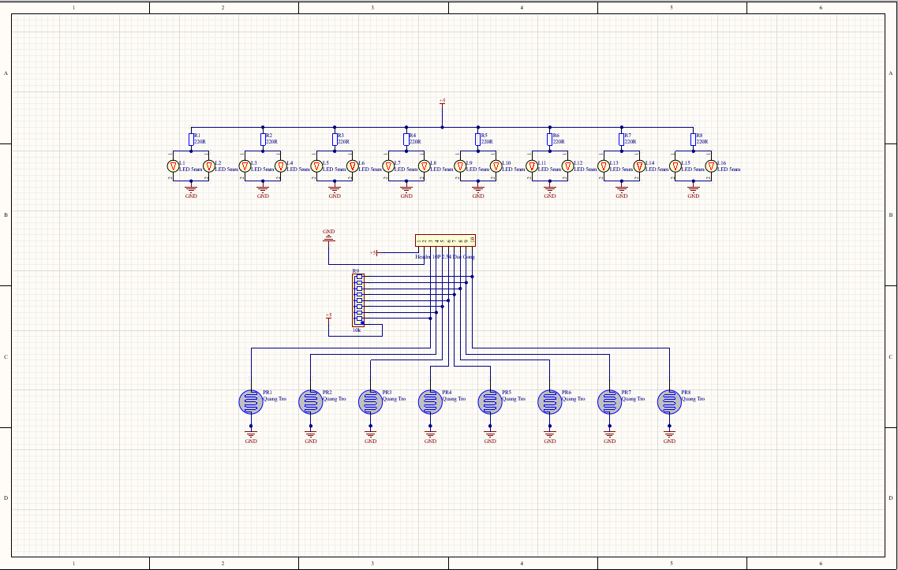
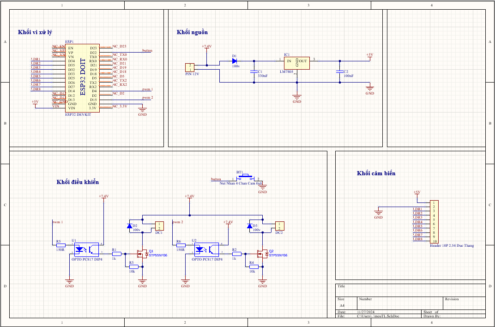
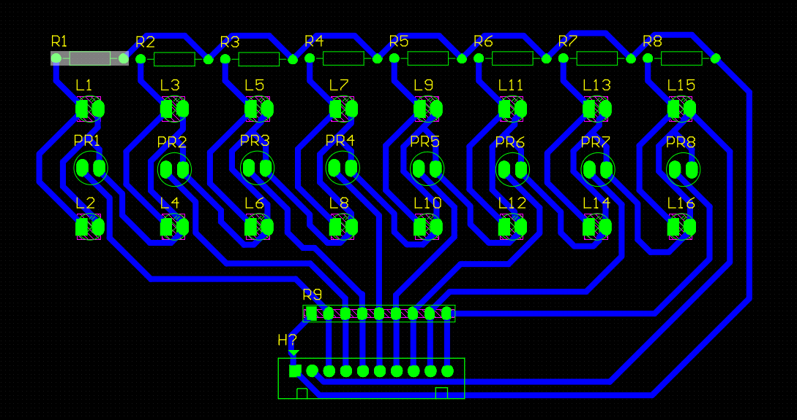
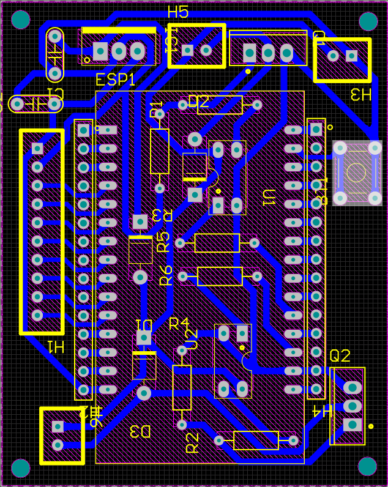
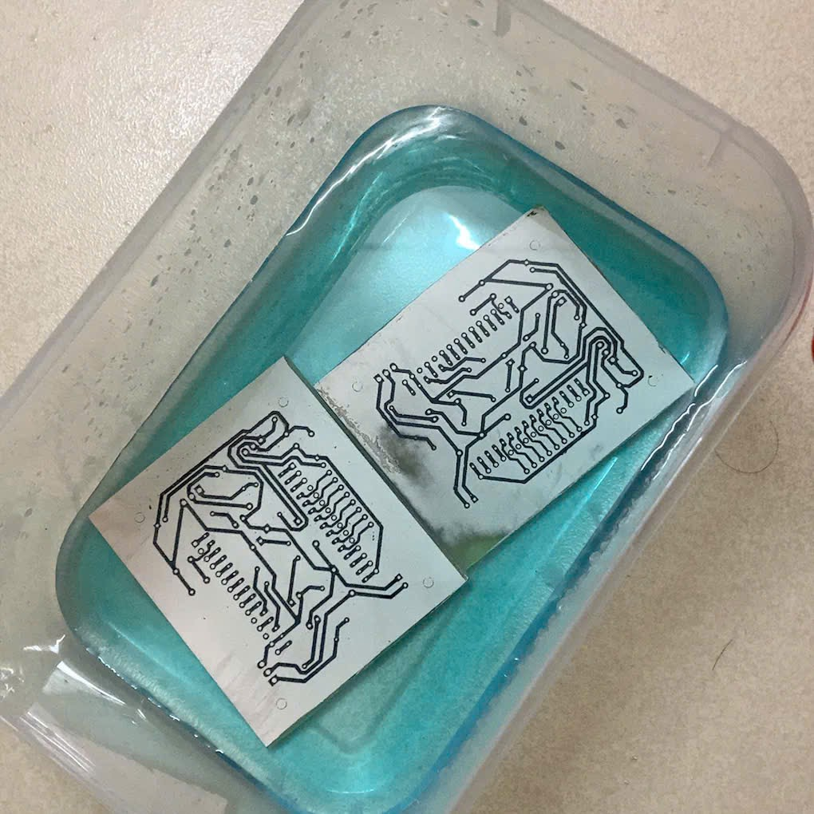
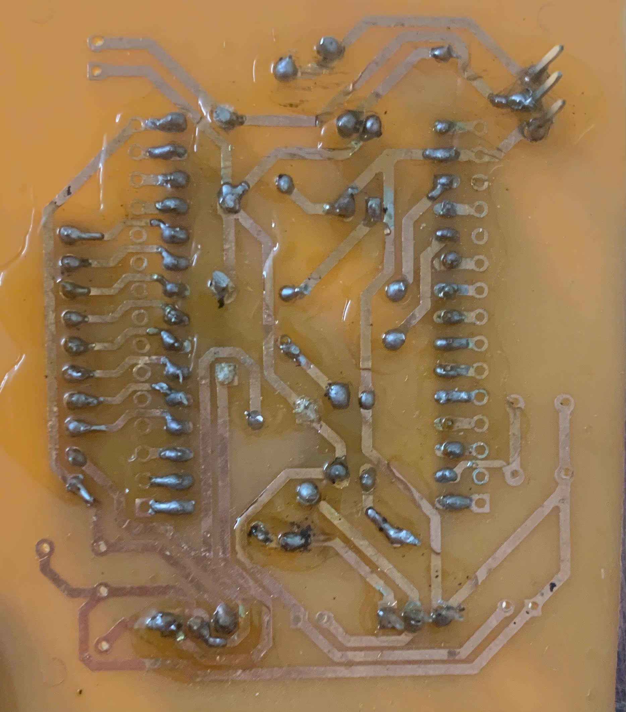
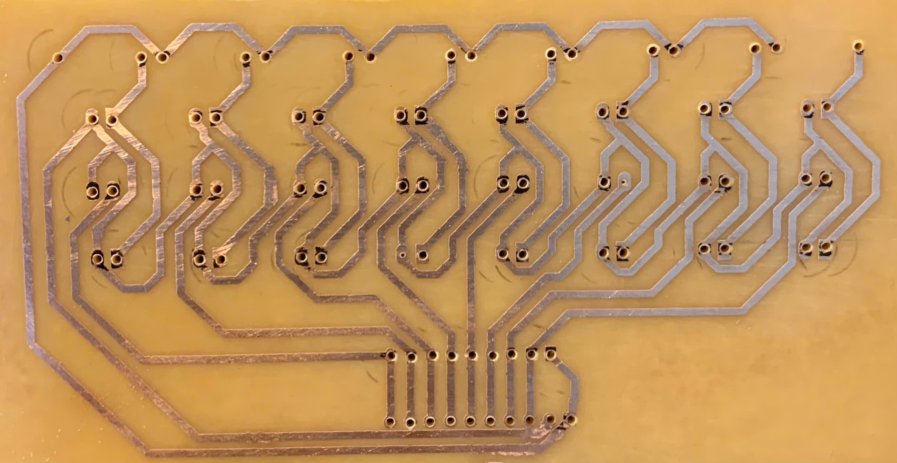
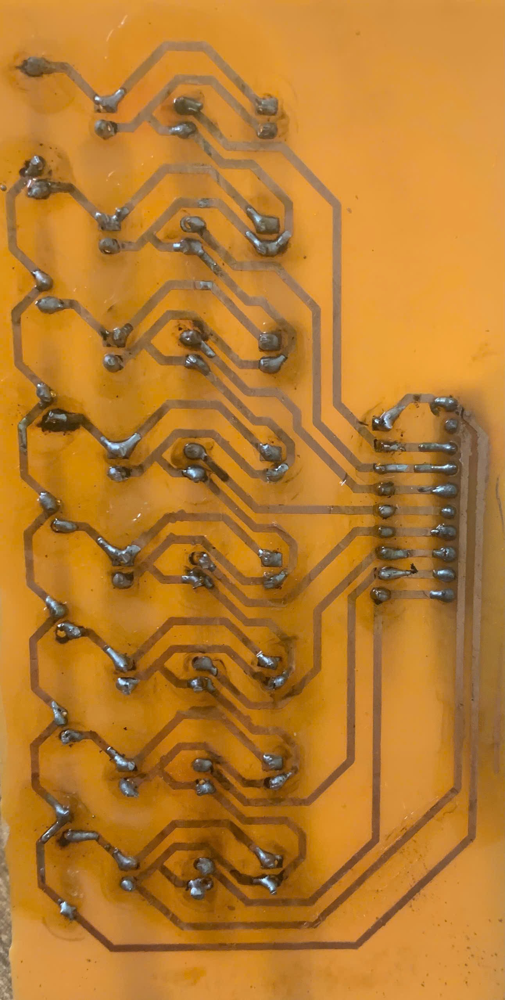

# Line - Tracking Robot
## Danh mục hình ảnh quy trình thực hiện
### 1. Vẽ mạch dò line và mach MCU bằng Altium

### 2. Sơ đồ đi dây của 2 mạch

### 3. Quá trình ăn mòn phíp đồng bằng muối ăn mòn chuyên dụng

### 4. Hàn linh kiện lên mạch

