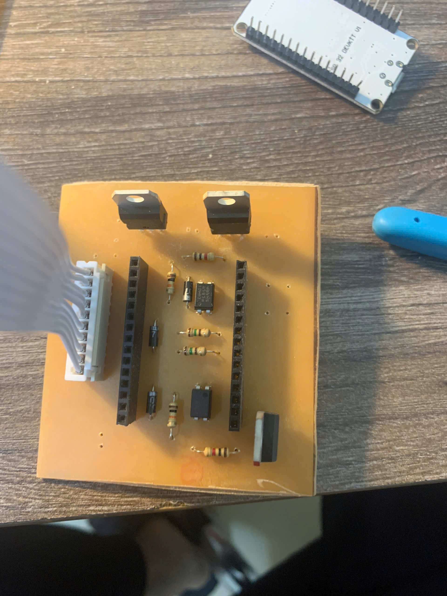

# Line-Tracking Robot

## Process Image Catalog

### 1. Design Line Sensor Circuit and MCU Circuit with Altium

#### Components in the Line Sensor Circuit:
1. Resistors 220 Ohm (8)
2. Photoresistors (8)
3. White LEDs (16)  
   - **Function**: Illuminate the surface to enhance the photoresistors' ability to differentiate the line color from the road.
4. 10-pin Header (1)
5. 10k Resistor Network (1)

#### Components in the MCU Circuit:
1. ESP32 DEV KIT V1 (1)
2. 2-pin Headers (3)
3. Capacitors:  
   - 100nF (1)  
   - 300nF (1)
4. LM7805 (1)  
   - **Function**: Voltage regulator to ensure a stable 5V power supply for the entire circuit.
5. MOSFETs (2)  
   - **Function**: Control the two wheels of the robot.
6. Resistors:  
   - 1k  
   - 10k  
   - 150k
7. Diodes  
   - **Function**: Prevent back EMF from damaging the MOSFET when the motor suddenly stops.
8. 10-pin Header (1)

---

### 2. Wiring Diagrams of Both Circuits

  

---

### 3. Etching Copper PCB Using Specialized Etching Salt

- **Tips:**  
  - If the copper traces fade after printing on the PCB, you can redraw them with a marker.  
  - Using hot water accelerates the etching process and results in cleaner traces.

  

---

### 4. Soldering Components onto the Circuit

  
  
  

---

# Coding Workflow

## 1. Calibrate ADC 
- Read the values from the 8 photoresistors, ensuring they are consistent in the same environment.  
- -> Determine the threshold for distinguishing between the line and the road.

## 2. Reduce Duty Cycle -> Slow Down the Motor and Calculate the Error
- `Error = Target - Pos`  
- If `Error > 0`, the right wheel should spin faster to turn right.  
- If `Error < 0`, the left wheel should spin faster to turn left.

## 3. Handle Line Loss
- Rotate one wheel to locate the line.

## 4. Tune Ki, Kp, Kd Parameters -> Determine the Optimal Values
- PID -> PWM -> Loop
- Initially, set a high **𝐾p** for quick error response.
- Gradually increase **𝐾i** to reduce accumulated error (if the robot becomes unstable).
- Use **𝐾d** to minimize overshoot and oscillations.
