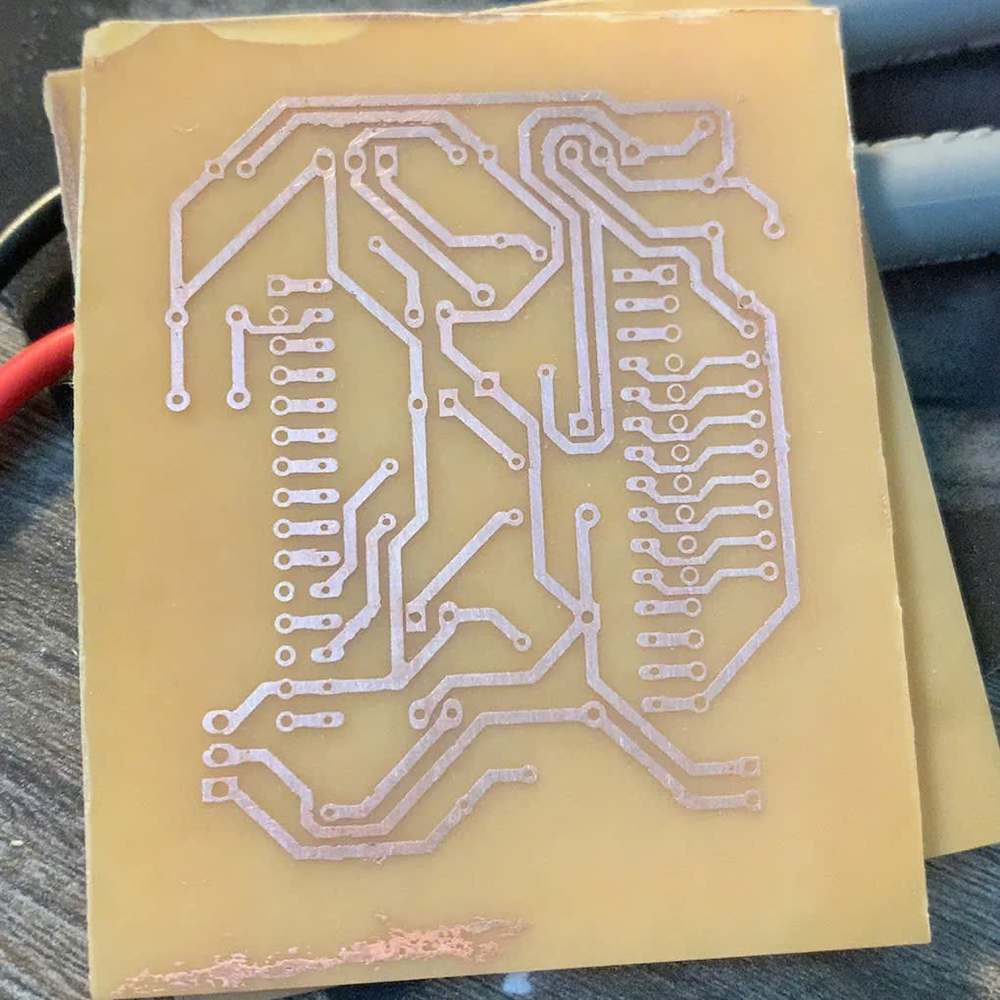

# Line-Tracking Robot

## Danh mục hình ảnh quy trình thực hiện

### 1. Vẽ mạch dò line và mạch MCU bằng Altium

#### Các linh kiện trong mạch dò line:
1. Điện trở 220 Ohm (8)
2. Quang trở (8)
3. LED trắng (16)  
   - Chức năng: Soi mặt phẳng xe chạy để quang trở tăng khả năng phân biệt màu sắc của line so với mặt đường.
4. Header 10pins (1)
5. Trở băng 10k (1)

#### Các linh kiện trong mạch MCU:
1. ESP32 DEV KIT V1 (1)
2. Header 2pins (3)
3. Tụ điện:  
   - 100nF (1)  
   - 300nF (1)
4. LM7805 (1)  
   - Chức năng: IC ổn áp, đảm bảo nguồn điện cấp cho toàn mạch ở mức 5V.
5. MOSFET (2)  
   - Chức năng: Điều khiển 2 bánh xe của robot.
6. Điện trở:  
   - 1k  
   - 10k  
   - 150k
7. Diode  
   - Chức năng: Ngăn dòng cảm ứng khi động cơ ngắt đột ngột gây ra có thể làm hỏng MOSFET.
8. Header 10pins (1)

---

### 2. Sơ đồ đi dây của 2 mạch

---

### 3. Quá trình ăn mòn phíp đồng bằng muối ăn mòn chuyên dụng

- **Tips:**  
  - Dây đồng bị mờ sau khi in lên phíp đồng có thể dùng bút lông tô lại.  
  - Dùng nước nóng sẽ giúp quá trình ăn mòn diễn ra nhanh hơn và dây đồng đẹp hơn.

---

### 4. Hàn linh kiện lên mạch

