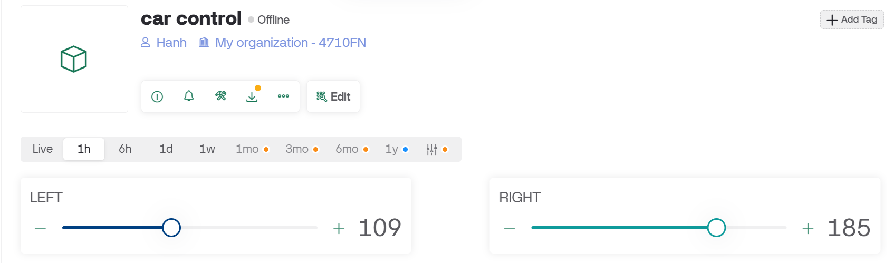
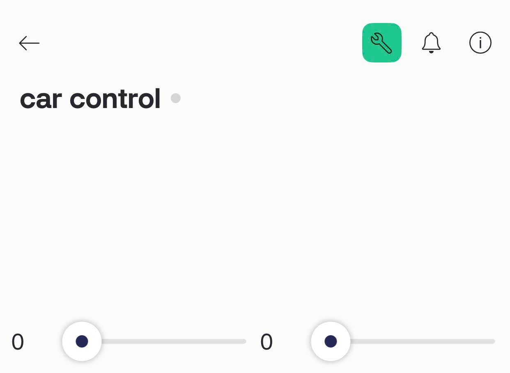

# Điều Khiển Xe Với 2 Động Cơ Sử Dụng App Blynk

## Mô Tả
Ý tưởng này tận dụng từ xe dò line có sẵn và sử dụng ESP32 để điều khiển xe robot với 2 động cơ DC. Xe có thể di chuyển tiến thông qua 2 bánh trái và phải được điều khiển bằng tín hiệu PWM từ hai chân GPIO4 và GPIO15. Ứng dụng Blynk được sử dụng để điều khiển tốc độ và hướng của động cơ.

## Phần Cứng
- **ESP32**
- **2 động cơ DC** (Điều khiển bằng PWM)

## Phần Mềm
- **Arduino IDE** hoặc **PlatformIO**
- **Blynk App** 
- **Blynk Auth Token**

## Kết Nối Phần Cứng
- **GPIO4**: Điều khiển động cơ trái.
- **GPIO15**: Điều khiển động cơ phải.

## Hướng Dẫn Cài Đặt

1. **Cài Đặt Blynk App**: Tải và tạo dự án trong ứng dụng Blynk, lưu lại **Auth Token**.
### Giao diện đơn giản trên Web Blynk IoT

### Giao diện trên điện thoại

2. **Cài Đặt Arduino IDE**: Cài đặt ESP32 board và thư viện Blynk.
3. **Kết Nối Phần Cứng**: Kết nối các động cơ với ESP32 qua các chân GPIO4 và GPIO15.
4. **Lập Trình**: Sử dụng mã nguồn sau để điều khiển động cơ qua PWM:
